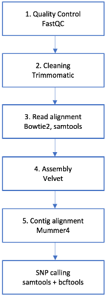

## 3. Containerising a WGS workflow

 [\<\< Part 2](https://github.com/PawseySC/bio-workshop-18/blob/master/2.fastqc.md)
 | [TOC](https://github.com/PawseySC/bio-workshop-18/blob/master/TableOfContents.md) |
 [Part 4 \>\>](https://github.com/PawseySC/bio-workshop-18/blob/master/4.hpc.md)
______

### Before we start
Scripts covering some of the examples in this Episode are in a subdirectory:

    cd bio-workshop-18/episode3_wgs_workflow/

---
### A sample bio-informatics workflow
You are going to work with the following sample workflow:

The `data_files/` folder contains two paired read files from a plant called *Fagopyrum tartaricum*.  
You are going to check the read quality and then clean them.  
Then, you will be aligning these reads against a reference genome of another plant of the same Genus, namely *Fagopyrum_esculentum*.  
This will be followed by a *de novo* assembly of the reads. Ideally, you would like to assembly only those reads that align against the reference, but for the sake of practicality, in this exercise you will be assembling all of the reads.  
You will then align the contigs resulting from the assembly with the reference, and finally do a SNP calling of the original reads against the reference.

This is meant to be a toy workflow, to illustrate how different types of packages can be containerised with Docker, and also to comment on some specific issues that can arise with certain containers.

### Hands-on: build your own containerised workflow
You will build the workflow using the skills you acquired in [Episode 1](https://github.com/PawseySC/bio-workshop-18/blob/master/1.containers.md) and [Episode 2](https://github.com/PawseySC/bio-workshop-18/blob/master/2.fastqc.md).

You won't need to build the workflow from scratch! In the Episode folder, there is a file named `workflow_start_here` that already contains the standard, non-containerised version of the workflow.

______
 [\<\< Part 2](https://github.com/PawseySC/bio-workshop-18/blob/master/2.fastqc.md)
 | [TOC](https://github.com/PawseySC/bio-workshop-18/blob/master/TableOfContents.md) |
 [Part 4 \>\>](https://github.com/PawseySC/bio-workshop-18/blob/master/4.hpc.md)
