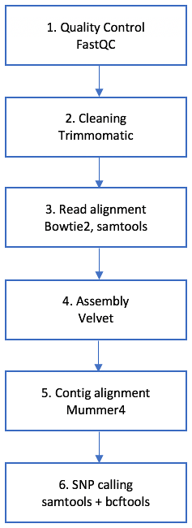

## 3. Containerising a WGS workflow

 [\<\< Part 2](https://github.com/PawseySC/bio-workshop-18/blob/master/2.fastqc.md)
 | [TOC](https://github.com/PawseySC/bio-workshop-18/blob/master/TableOfContents.md) |
 [Part 4 \>\>](https://github.com/PawseySC/bio-workshop-18/blob/master/4.hpc.md)
______

### Before we start
Scripts covering some of the examples in this Episode are in a subdirectory:

    cd bio-workshop-18/episode3_wgs_workflow/

---
### A sample bioinformatics workflow
The `data_files/` folder contains two paired read files from a plant called *Fagopyrum tartaricum*, as well as a reference genome from another plant of the same Genus, namely *Fagopyrum_esculentum*. To allow for the workflow to be run in a short timeframe, the number of reads has been limited to 100,000.

From inside `episode3_wgs_workflow/`, You are going to work with the following sample workflow:

This is meant to be a toy workflow, to illustrate how different types of packages can be containerised with Docker, and also to comment on some specific issues that can arise with certain containers.

---
### Hands-on: build your own containerised workflow
You will build the workflow above using the skills you acquired in [Episode 1](https://github.com/PawseySC/bio-workshop-18/blob/master/1.containers.md) and [Episode 2](https://github.com/PawseySC/bio-workshop-18/blob/master/2.fastqc.md).

The scope of this Episode is not to build it from scratch, but rather to port it from a preexisting, non-containerised version. In the Episode folder, there is a file named `workflow_start_here` that contains your starting point.

Here are your tasks:
1. identify all the container repositories required for the workflow and pull them using shifter.  
  Ideally, you would search for each package in QUAY Hub or Docker Hub; however, to save time during this workshop, you can find the list of repositories to be downloaded in the file named `containers`;
2. for each step in the workflow, write a bash script that executes the corresponding commands using Docker containers;
3. write a driver bash script that executes the step scripts in sequence.

---
### Tips and hints
Some useful tips:
- in the Episode directory there are template containers ready for use;
- you can define and execute multiple containers in the same script;
- to have a more readable container execution line, define environment variables with the container repository names;
- you will need to specify some Docker flags, as in [Episode 2](https://github.com/PawseySC/bio-workshop-18/blob/master/2.fastqc.md); an environment variable can again be useful for the purpose;
- for the pull and the driver scripts, you can just write a sequence of commands, or ... use a `for` loop.

Some hints for special cases:
- for Java packages, you will need to inspect the container to find out the location of the .jar file;
- for Trimmomatic, adapters are in the `adapters/` directory inside the Episode directory;
- output redirection with `>` works straight away with Docker containers;
- input redirection with `<` and piping with `|` requires some care, with an extra Docker flag required (review those discussed in [Episode 1](https://github.com/PawseySC/bio-workshop-18/blob/master/1.containers.md)).

---
### 2. Solution for Trimmomatic: a Java container
In the cleaning step, to run **Trimmomatic** you need a command like:

    java -jar ${PATH_TO_TRIMMOMATIC_JAR}/trimmomatic.jar

Where is `trimmomatic.jar` located inside the container? Let us find out by means of an interactive container session:

    docker run -it --rm quay.io/biocontainers/trimmomatic:0.38--0 bash

Inside the container, let us look for the jar file and then exit:

    find / -name "*trimmomatic*.jar" && exit

The output will solve your quest:

    /usr/local/share/trimmomatic-0.38-0/trimmomatic.jar

As mentioned in [Episode 2](https://github.com/PawseySC/bio-workshop-18/blob/master/2.fastqc.md), biocontainers in QUAY Hub have usually packages installed into `usr/local/`.

Finally, some further inspection of this **Trimmomatic** container reveals there is a `trimmomatic` executable script available. This script can be used in substitution of the typical way of invoking Java packages, so that both of these will work:

    docker run <options> <cont ID> java -jar /usr/local/share/trimmomatic-0.38-0/trimmomatic.jar <arguments>
and

    docker run <options> <cont ID> trimmomatic <arguments>

---
### 6. Solution for piping with samtools and bcftools
In the SNP calling step, two command lines in the starting workflow contain piping operations with `|`, something like:

    app1 <args1> | app2 <args2>

You can try and containerise this line as you did in the previous steps:

    run_flags="--rm -v $(pwd):/data -w /data"
    docker run $run_flags $cont1 app1 <args1> | docker run $run_flags $cont2 app2 <args2>

However, you will get an error similar to:

    write /dev/stdout: broken pipe

This happens because the first command tries to send output to the second one, but does not succeed because the second container does not have the standard input open.

How to open it? Well, just re-use a Docker flag we saw in [Episode 1](https://github.com/PawseySC/bio-workshop-18/blob/master/1.containers.md)) when talking about interactive sessions: `-i`:

    docker run $run_flags $cont1 app1 <args1> | docker run -i $run_flags $cont2 app2 <args2>

This will do the job!

---
### Complications when looking for containers in Web repositories

The list of repositories contained in the file "`containers`" has some useful behind the scenes. In particular:

- For **Mummer**, one could try and use the containers for **Version 3.x** from both QUAY Hub and Docker Hub; however, one has a broken `mummer` script, and the other one has a broken `mummerplot` script.  
The container for **Mummer4** from QUAY Hub works fine and is the one used in this Episode.

- For **bcftools**, the container from QUAY Hub has a broken `vcfutils.pl`, as it comes with no Perl installed!  
The container from Docker Hub works fine and has been used in this Episode.

These types of issues do not happen often, but can still happen.  
What if no working container can be found in the Web repositories? Well, you can consider build your own, by writing a Dockerfile: see [Episode 5](https://github.com/PawseySC/bio-workshop-18/blob/master/5.sincell_workflow.md).

______
 [\<\< Part 2](https://github.com/PawseySC/bio-workshop-18/blob/master/2.fastqc.md)
 | [TOC](https://github.com/PawseySC/bio-workshop-18/blob/master/TableOfContents.md) |
 [Part 4 \>\>](https://github.com/PawseySC/bio-workshop-18/blob/master/4.hpc.md)
