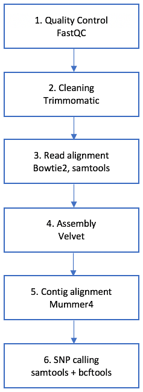

## 4. Containerising a WGS workflow

 [\<\< Episode 3](https://github.com/PawseySC/bio-workshop-18/blob/master/3.fastqc.md)
 | [TOC](https://github.com/PawseySC/bio-workshop-18/blob/master/README.md) |
 [Episode 5 \>\>](https://github.com/PawseySC/bio-workshop-18/blob/master/5.hpc.md)
______

### Before we start
Change directory to the path relevant for this Episode:

    cd bio-workshop-18/episode4_wgs_workflow/


---
### A sample bioinformatics workflow
The folder `bio-workshop-18/data_files/` contains two paired read files from a plant called *Fagopyrum tartaricum*, `SRR6166481_sub_1.fastq.gz` and `SRR6166481_sub_2.fastq.gz`, as well as a reference genome from another plant of the same Genus, namely *Fagopyrum_esculentum*, file `Fagopyrum_esculentum.fasta`. To allow for the workflow to be run in a short timeframe, the number of reads has been limited to 100,000.

From inside `episode4_wgs_workflow/`, we are going to work with the following sample workflow:



This is meant to be a toy workflow, to illustrate how different types of packages can be containerised with Docker, and also to comment on some specific issues that can arise with certain containers.


---
### Hands-on: let us build a containerised workflow
We will build the workflow above using the skills acquired in [Episode 2](https://github.com/PawseySC/bio-workshop-18/blob/master/2.containers.md) and [Episode 3](https://github.com/PawseySC/bio-workshop-18/blob/master/3.fastqc.md).

The scope of this Episode is not to build the workflow from scratch, but rather to port it from a preexisting, non-containerised version. The full sequence of commands corresponding to the latter are written inside a file named `workflow_original.sh`. We can inspect the content of this script with `cat`:

    cat workflow_original.sh

For convenience this original scriptfile has been cut into six bash scripts, whose names start with numbers `1` to `6`. Each of these scripts corresponds to a step in the workflow above, and can be used as starting point for the exercise:

```
ls -1 *.sh

1.fastqc.sh
2.trimmomatic.sh
3.bowtie2.sam.sh
4.velvet.sh
5.mummer4.sh
6.bcftools.sam.sh
workflow_original.sh
```

Ideally, we would search for each required package in [QUAY Hub](https://quay.io) or [Docker Hub](https://hub.docker.com). However, to save time during the workshop, the list of repositories to be downloaded is available in the file named `list_of_containers`:

```
cat list_of_containers

quay.io/biocontainers/fastqc:0.11.7--4
quay.io/biocontainers/trimmomatic:0.38--0
quay.io/biocontainers/bowtie2:2.3.4.2--py27h2d50403_0
quay.io/biocontainers/samtools:1.9--h46bd0b3_0
quay.io/biocontainers/velvet:1.2.10--1
quay.io/biocontainers/mummer4:4.0.0beta2--pl526hfc679d8_3
biocontainers/bcftools:v1.3.1-1b1-deb_cv1
```

Here are our goals:
1. write a script for a one-off pull of all container repositories required for the workflow;
2. for each step in the workflow, edit the provided bash script so that it runs the bioinformatics packages using Docker containers;
3. write an optional driver bash script that executes all the step scripts in sequence.


---
### Pull the required packages
We need to write a script that runs a set of `docker pull` to download the required repositories.  
To save on typing, let us start from the file  `list_of_containers`:

    cp list_of_containers pull_containers.sh
    
    nano pull_containers.sh

We are using `nano`, a text editor, for editing the new file `pull_containers.sh` to prepend the command `docker pull` to each repository name. We will also need to add the bash shebang `#!/bin/bash` at the beginning of the script. The final result is:

```
#!/bin/bash

docker pull quay.io/biocontainers/fastqc:0.11.7--4
docker pull quay.io/biocontainers/trimmomatic:0.38--0
docker pull quay.io/biocontainers/bowtie2:2.3.4.2--py27h2d50403_0
docker pull quay.io/biocontainers/samtools:1.9--h46bd0b3_0
docker pull quay.io/biocontainers/velvet:1.2.10--1
docker pull quay.io/biocontainers/mummer4:4.0.0beta2--pl526hfc679d8_3
docker pull biocontainers/bcftools:v1.3.1-1b1-deb_cv1
```

Let us save the file in `nano` using `Ctrl-O` (`Enter` to confirm) and then quit with `Ctrl-X`.

Now, let us grant execution permission to the script we created:

    chmod +x pull_containers.sh

And finally run it:

    ./pull_containers.sh

After a few minutes of processing, the container images required for our workflow have been downloaded.


---
### 1. Quality control with FastQC

As this step involves exactly the same command discussed in [Episode 3](https://github.com/PawseySC/bio-workshop-18/blob/master/3.fastqc.md), the script `1.fastqc.sh` has already been completed, and is ready to be run. Let us have a look at its contents:

```
cat 1.fastqc.sh


#!/bin/bash
run_flags="--rm -v $(pwd):/data -w /data"

cp -p ../data_files/SRR6166481_sub_[12].fastq.gz .

docker run $run_flags quay.io/biocontainers/fastqc:0.11.7--4 fastqc -o . SRR6166481_sub_1.fastq.gz

docker run $run_flags quay.io/biocontainers/fastqc:0.11.7--4 fastqc -o . SRR6166481_sub_2.fastq.gz
```

Because we are going to use the same flags for all `docker run` commands in all these scripts, at the top of each script we are defining a variable called `run_flags` to store their values and then use them when required:

    run_flags="--rm -v $(pwd):/data -w /data"

This is simpler to type and less error prone.
Now let us run this step:

    ./1.fastqc.sh


---
### 2. Cleaning with Trimmomatic - a Java container
Let us edit the corresponding script with `nano 2.trimmomatic.sh` (see instructions for `nano` in the section [Pull the required packages](#Pull-the-required-packages) above).

First, note the use of "`\`" at end of lines to break a long line into multiple ones and improve readability.

We need to prepend:

    docker run $run_flags quay.io/biocontainers/trimmomatic:0.38--0 

to the `java` execution line.

Now let us read through the `java` arguments to see if we need to provide further information. The command is of the form:

    java -jar <path-to-trimmomatic-jar>/trimmomatic.jar

Where is `trimmomatic.jar` located inside the container? Let us find out. We need to temporarily close `nano` and start an interactive container session:

    docker run -it --rm quay.io/biocontainers/trimmomatic:0.38--0 bash

Inside the container, let us look for the jar file using the `find` command:

    find / -name "*trimmomatic*.jar"

The output will solve our quest:

    /usr/local/share/trimmomatic-0.38-0/trimmomatic.jar

As mentioned in [Episode 3](https://github.com/PawseySC/bio-workshop-18/blob/master/3.fastqc.md), biocontainers in QUAY Hub have usually packages installed into `/usr/local/`. We can now `exit` the interactive session:

    exit

Now we can complete the path to `trimmomatic.jar` in the script file using `nano`.

There is another file required by **Trimmomatic**, the one containing the adapter sequences. In this example the command line will look for `adapters/all_PE.fa`, which for convenience is already provided in the Episode directory.

Let us have a look at the final script:

```
#!/bin/bash
run_flags="--rm -v $(pwd):/data -w /data"

docker run $run_flags quay.io/biocontainers/trimmomatic:0.38--0 java -jar \
    /usr/local/share/trimmomatic-0.38-0/trimmomatic.jar \
    PE SRR6166481_sub_1.fastq.gz SRR6166481_sub_2.fastq.gz \
    SRR6166481_sub_1_paired.fastq.gz SRR6166481_sub_1_unpaired.fastq.gz \
    SRR6166481_sub_2_paired.fastq.gz SRR6166481_sub_2_unpaired.fastq.gz \
    ILLUMINACLIP:adapters/all_PE.fa:2:30:10 LEADING:3 TRAILING:3 SLIDINGWINDOW:4:15 MINLEN:36
```

We can now run it:

    ./2.trimmomatic.sh

**Advanced note:** some further inspection of this **Trimmomatic** container reveals there is a `trimmomatic` executable script available. This script can be used in substitution of the typical way of invoking Java packages, so that both of these will work:

    docker run <options> <cont ID> java -jar /usr/local/share/trimmomatic-0.38-0/trimmomatic.jar <arguments>
and

    docker run <options> <cont ID> trimmomatic <arguments>


---
### 3. Read alignment with Bowtie2 and samtools
Let us edit the script with `nano 3.bowtie2.sam.sh`.

In this step we are using executables from two distinct containerised packages.  
`bowtie2-build` and `bowtie2` are part of **Bowtie2**, and we are prepending the following to them:

    docker run $run_flags quay.io/biocontainers/bowtie2:2.3.4.2--py27h2d50403_0

Similarly, in the case of the command `samtools` we need to prepend the instruction to run the appropriate container:

    docker run $run_flags quay.io/biocontainers/samtools:1.9--h46bd0b3_0

Let us run the script:

    ./3.bowtie2.sam.sh


---
### 4. Assembly with Velvet
Let us edit the script with `nano 4.velvet.sh`.

Both commands `velveth` and `velvetg` are part of the **Velvet** package, and need the following to be prepended:

    docker run $run_flags quay.io/biocontainers/velvet:1.2.10--1

Let us run the step:

    ./4.velvet.sh


---
### 5. Contig alignment with Mummer4
Let us edit the script with `nano 5.mummer4.sh`.

`mummer` and `mummer4` both need the following to be prepended:

    docker run $run_flags quay.io/biocontainers/mummer4:4.0.0beta2--pl526hfc679d8_3

The last command in the script uses the `gnuplot` utility for plotting. In this workshop, we are assuming that `gnuplot` is installed as a system package in the host machine, and therefore running it without containers.

Now let us run the step:

    ./5.mummer4.sh

**Note on looking for the Mummer container:** 
in both QUAY Hub and Docker Hub there are also containers for **Mummer** **Version 3.x**. However, one of these has a broken `mummer` script, and the other one has a broken `mummerplot` script. 
The container for **Mummer4** from QUAY Hub works fine and is the one used in this Episode.  
These types of issues can happen when looking for containers, though not often.


---
### 6. SNP calling with samtools and bcftools
Let us edit the script with `nano 6.bcftools.sam.sh`.

In this script we are using three different executables:
- `samtools` appears three times and require the following to be prepended:

        docker run $run_flags quay.io/biocontainers/samtools:1.9--h46bd0b3_0

- `bcftools` (twice) and `vcfutils.pl` are both part of `bcftools` and in principle require the following:

        docker run $run_flags biocontainers/bcftools:v1.3.1-1b1-deb_cv1

However, special care is required for the third and fourth command lines in the script, as they involve piping: the pipe symbol "`|`" is used to pass the output of the first command in each line to the second one in the same line, as in:

    app1 <args1> | app2 <args2>

We could try and containerise this type of line as usual:

    docker run $run_flags <cont1> app1 <args1> | docker run $run_flags <cont2> app2 <args2>

However, we would get an error like:

    write /dev/stdout: broken pipe

This happens because the second container does not have the standard input open.  
How can we open it? By adding a Docker flag we have seen in [Episode 2](https://github.com/PawseySC/bio-workshop-18/blob/master/2.containers.md) when talking about interactive sessions, namely "`-i`":

    docker run $run_flags <cont1> app1 <args1> | docker run -i $run_flags <cont2> app2 <args2>

This will do the job!

Let us run this final step:

    ./6.bcftools.sam.sh

**Note on looking for the bcftools container:** 
the container from QUAY Hub has a broken `vcfutils.pl`, as it comes with no Perl installed! The container from Docker Hub works fine and has been used in this Episode.  
These types of issues can happen when looking for containers, though not often.


---
### Driver script
We can write a trivial script to execute the whole workflow in one shot, by putting together the executions of all step scripts. Such a script should contain:

```
#!/bin/bash

./1.fastqc.sh
./2.trimmomatic.sh
./3.bowtie2.sam.sh
./4.velvet.sh
./5.mummer4.sh
./6.bcftools.sam.sh 
```


---
### Conclusion
- Very often, a containerised package can be run straight away by modifying the original execution line as follows:

        docker run <docker flags> <container ID> <original line>

- Some packages, such as Java ones, might require a one-off inspection of the container, in order to find the location of package-specific files;

- Care is required for redirection and piping with Docker containers:
  - output redirection with "`>`" works straight away;
  - input redirection with "`<`" requires the extra flag "`-i`";
  - piping with "`|`" requires the extra flag "`-i`" for the container that receives input.


______
 [\<\< Episode 3](https://github.com/PawseySC/bio-workshop-18/blob/master/3.fastqc.md)
 | [TOC](https://github.com/PawseySC/bio-workshop-18/blob/master/README.md) |
 [Episode 5 \>\>](https://github.com/PawseySC/bio-workshop-18/blob/master/5.hpc.md)
